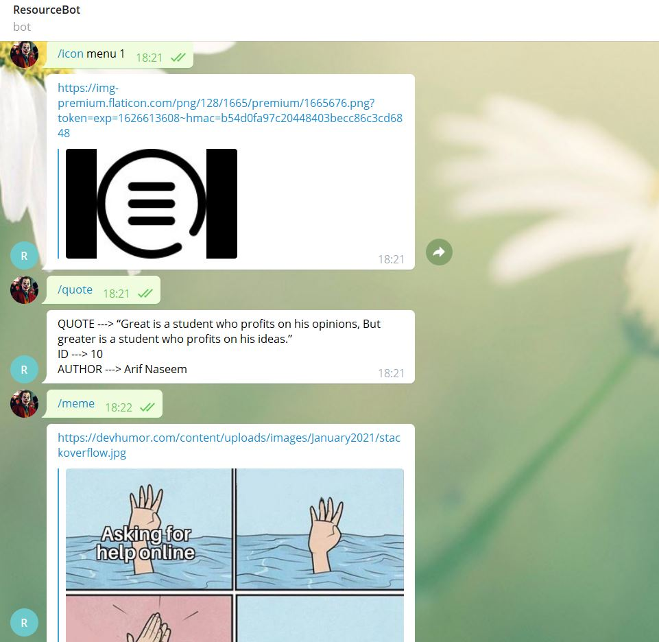

## Resource Telegram Bot
This will get the latest meme and quotes. It uses the requests library to update and fetch data.

#### Preview


#### Features : -
1. Simple commands
2. <code>/help</code> to get started
3. meme and quote command are present on initial realease
4. Ultra fast
5. Less dependencies

### Topics -> python, telegram-bot, bots
<h5>Preview Link -> <u><a href=""></a></u></h5>
<h5>Source Code Link -> <u><a href="">GitHub</a></u></h5>
<strong>What We are going to do?</strong>
<ol>
    <li>Initialization of Resource Bot</li>
    <li>Extracting the icons from flaticon and blogs from csstricks</li>
    <li>Loading memes and quote from json file</li>
    <li>Making commands and providing response in real time to users</li>
</ol>

<strong>Some Important Concept</strong>
We will be using the requests-html for scraping.

**But, What is requests-html?**
This library intends to make parsing HTML (e.g. scraping the web) as simple and intuitive as possible.

Features : -
<ul>
    <li><strong>Full JavaScript support</strong>!</li>
    <li><em>CSS Selectors</em> (a.k.a jQuery-style, thanks to PyQuery).</li>
    <li><em>XPath Selectors</em>, for the faint of heart.</li>
    <li>Mocked user-agent (like a real web browser).</li>
    <li>Automatic following of redirects.</li>
    <li>Connection–pooling and cookie persistence.</li>
    <li>The Requests experience you know and love, with magical parsing abilities.</li>
    <li><strong>Async Support</strong></li>
</ul>

**Requests ?**
Requests is a Python HTTP library, released under the Apache License 2.0. The goal of the project is to make HTTP requests simpler and more human-friendly. 

<strong>Installing Required libraries :- </strong>
```
pip install requests
pip install requests_html
```
## Step 1 => Initialization of Resource Bot
First get the API from <a href="https://core.telegram.org/">Telegram Official Page</a>

**Importing Required libraries and variables**
```
import json

import requests

Token = "<Enter Your Token>"

def send_messages(self, msg, chat_id):
    url = f"{self.base}/sendMessage?chat_id={chat_id}&text={msg}"
    if msg is not None:
        requests.get(url) 
```

**Initializing the Bot class and request url with our API token**
```
class ResourceBot():
    def __init__(self):
        self.token = Token
        self.base = f"https://api.telegram.org/bot{self.token}"

....
```

**Syncing the message receive**
```
class ResourceBot():
....
def get_updates(self, offset=None):
url = f"{self.base}/getUpdates?timeout=100"
if offset:
url = url + f"&offset={offset + 1}"
r = requests.get(url)
return json.loads(r.content)
....
```

**Sending message from our bot**
```
class ResourceBot():
.... 
def send_messages(self, msg, chat_id):
url = f"{self.base}/sendMessage?chat_id={chat_id}&text={msg}"
if msg is not None:
requests.get(url)
```

<strong>Whole Client at Once</strong>

```
import json

import requests

Token = "<Enter your Token>"


class ResourceBot():
    def __init__(self):
        self.token = Token
        self.base = f"https://api.telegram.org/bot{self.token}"

def get_updates(self, offset=None):
    url = f"{self.base}/getUpdates?timeout=100"
    if offset:
        url = url + f"&offset={offset + 1}"
    r = requests.get(url)
    return json.loads(r.content)

def send_messages(self, msg, chat_id):
    url = f"{self.base}/sendMessage?chat_id={chat_id}&text={msg}"
    if msg is not None:
        requests.get(url) 
```


## Step 2 => Extracting the icons from flaticon and blogs from csstricks  

We will use requests-html to extract the icons from flaticon and blogs from csstricks. We will use the css selectors to locate the element.
We must have url depending on the input tag. We can frame url using our custom function.                        

<strong>Fetching the data from the url using Request-html</strong>

```
def url_to_text(url):
    r = requests.get(url)
    if r.status_code == 200:
    html_text = r.text
    return html_text
```

**r.status_code** will check the response status code. If it is valid then proceed to other part.
<strong>Parsing the Html code using HTML from requests-HTML</strong>

# It will parse the html data into structure way

```
def pharse_and_extract(url, name=2020):
    html_text = url_to_text(url)
    if html_text is None:
        return ""
    r_html = HTML(html=html_text)
    return r_html
```

<strong>Getting Blogs from Css Tricks</strong>
It will find all the post using the css class. Then it will loop through all the posts and get all the required details like title and text.

```
def extract_from_css_tricks(res_html):
    resulted_tricks = []
    titles=res_html.find(".article-article h2 a")
    for title in titles:
        resulted_tricks.append(title.attrs['href'])
    return resulted_tricks
```

<strong>Getting Icons from Flaticons</strong>
We will make a custom url using the input tag. Then scrape the urls from that page.

```
def extract_icons_url(res_html,limit=1):
    icons_url = []
    titles=res_html.find(".icon--holder>a>img")
    for title in titles:
        icons_url.append(title.attrs['data-src'])
    return " \n".join(icons_url[:limit])
```

## Step 3 => Loading memes and quote from json file
We will load the memes and quotes from file using the JSON library

```
with open(f'{dir_path}/memes.json', encoding="utf8") as file:
meme_data = json.loads(file.read())

with open(f'{dir_path}/quotes.json', encoding="utf8") as file:
quotes_data = json.loads(file.read())
```

## Step 4 => Making commands and providing response in real time to users
<ol>
    <li>Make commands, so that we may know what the user want depending on the input supplied</li>
    <li>Framing the url when needed</li>
    <li>Replying using the custom formatter.</li>
</ol>

**1. Initializing the commands**

```
def make_reply(message):
    reply = None
    if message == '/help':
        reply = "Type \n/meme to get meme \n/quote to get quote"
    elif message == '/meme':
        reply = random.choice(meme_data)
    elif message == '/resource':
        reply = "https://css-tricks.com/too-many-svgs-clogging-up-your-markup-try-use/"
    elif message == '/quote':
        reply = format_message(random.choice(quotes_data))
    elif message.startswith('/icon'):
        search_icon,*params = message.split(" ")
        if len(params)>1:
            flaticon_url = f"https://www.flaticon.com/search?word={params[0]}"
            icons = extract_icons_url(pharse_and_extract(flaticon_url),limit=int(params[-1]))
            reply = icons
    return reply
```

We had used the custom formatter for quote command i.e <tt>format_message</tt>

```
def format_message(msg):
    formatted_msg = ""
    for i in msg:
        formatted_msg += f"{i.upper()} ---> {msg[i]}\n"
    return formatted_msg
```

## Deployment
You can only deploy on <a href="https://replit.com/">Repl</a> or <a href="https://www.heroku.com/">Heroku</a>.


#### How to get started : -
1. Install the dependencies by following command  
<code>pip3 install -r requirements.txt</code>
2. Enter your token in <code>main.py</code>
3. Run the <code>server.py</code> to start the bot
4. Type `/help` to get started
5. Type `/meme` to get meme.
6. Type `/resource` to get recent resource. It's hardcoded in intial release.
7. Type `/icon <query> <n>` where `n` must be integer for how may icons you want about a particular `query` 

##### Note  : -
All the changes are most welcomed. Feel free to make pull requests and raise issues.

##### Last Update :  -
20 April 2021